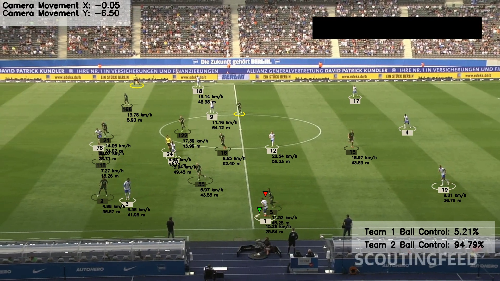

# Football Analysis Project

## Overview

This project is designed to analyze football game footage. It detects and tracks player movements, calculates player speed and distance covered, measures ball control percentage by each team, and classifies players by team and referees separately. It even tracks the ball movement and also detects the player in control of the ball.



## Features

- **Player Movement Analysis:** Tracks and visualizes player movements on the field.
- **Speed and Distance Calculation:** Measures the speed and the distance covered of each player throughout the match.
- **Ball Control Percentage:** Calculates and displays the ball control percentage for each team.
- **Player Classification:** Classifies players by team and distinguishes referees.
- **Optical Flow:** Measure camera movement
- **Perspective Transformation:** Represent scene depth and perspective

## Model Information

The project uses a combination of computer vision and machine learning models to perform the analysis:

1. **Object Detection Model:** Utilizes YOLOv5 for detecting players, referees, and the ball.
2. **Object Tracking Algorithm:** Implements SORT (Simple Online and Realtime Tracking) for tracking player movements.
3. **Speed Calculation:** Uses the distance formula and frame rate to compute player speed.
4. **Ball Control Calculation:** Determines ball possession by analyzing which team has more interactions with the ball over time.

## Models Used
The following modules are used in this project:

- **YOLO:** AI object detection model
- **Kmeans:** Pixel segmentation and clustering to detect t-shirt color

## Requirements

- Python 3.8+
- ultralytics
- OpenCV
- PyTorch
- YOLOv5
- Roboflow
- numpy
- pandas
- matplotlib

## How to Use

- **Clone the Repository:**

```bash
git clone https://github.com/void-sarthak/Football-Analysis.git
cd football-analysis
```

- **Prepare Your Video:**
Place your input video file in the input_videos directory and change the path of the video in the main.py file at line 12

- **Place the Model:**
Download the [Model](https://drive.google.com/file/d/1--yFQ2G--ymn27bWwX4B9OLVLqPOSCZ6/view?usp=sharing) and place it in the models folder.

- **Run the file:**
Run the main.py file

```bash
python main.py
```

- **Output of the Video:**
The output video will be generated in the output_videos folder and can be accessed from there.